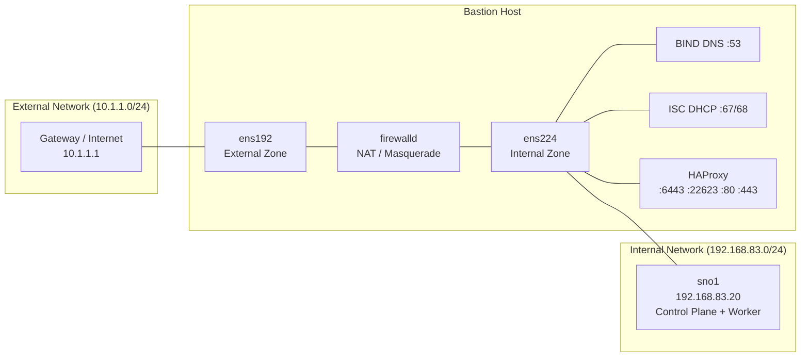
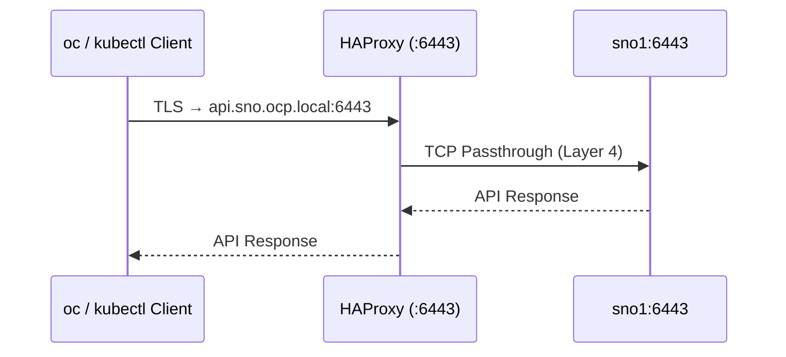
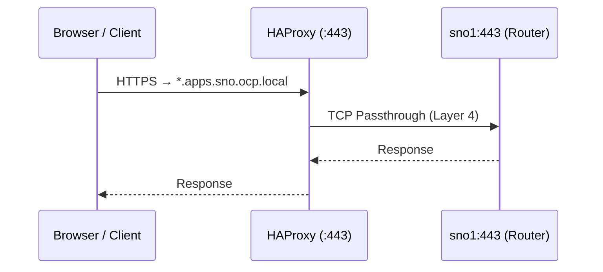
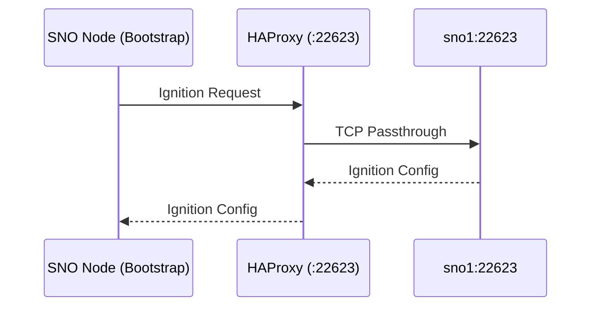
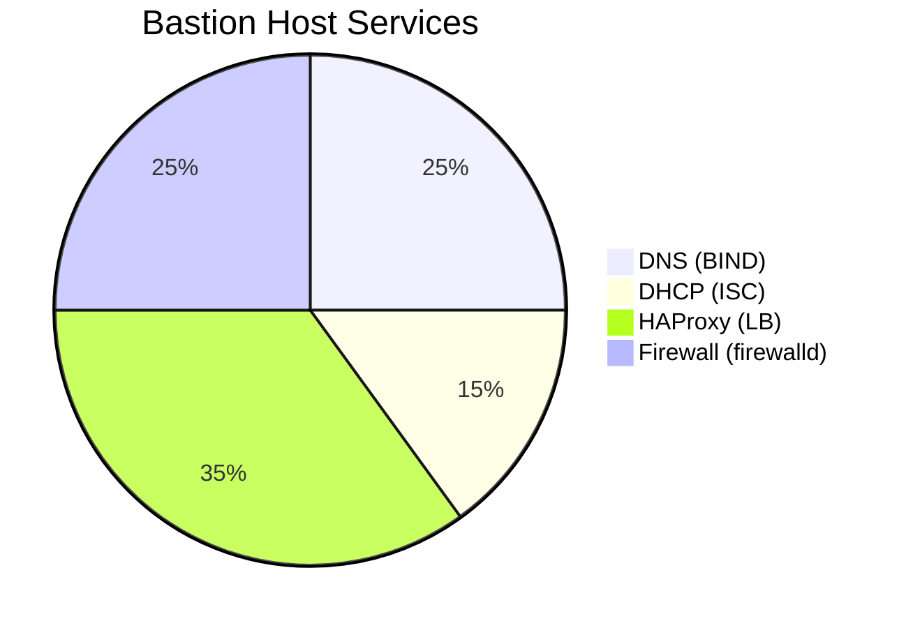

# :material-sitemap: Architecture Overview

This page provides a detailed breakdown of the **network topology, component roles, and traffic flows** for the Single Node OpenShift (SNO) deployment.

---

## Network Topology

The deployment uses a **dual-NIC Bastion Host** design that bridges two isolated network segments:

---

## IP Address Plan

| Host | FQDN | IP Address | Network | Role |
|------|------|------------|---------|------|
| Bastion | `bastion.ocp.local` | `192.168.83.10` | Internal | Infrastructure Services |
| Bastion | — | `10.1.1.x` | External | Internet Gateway |
| SNO Node | `sno1.sno.ocp.local` | `192.168.83.20` | Internal | OCP Control Plane + Worker |

---

## DNS Records

The following DNS records are configured on the Bastion's BIND server for the `ocp.local` domain:

### Forward Zone (`ocp.local`)

| Record | Type | Value | Purpose |
|--------|------|-------|---------|
| `bastion.ocp.local` | A | `192.168.83.10` | Bastion Host |
| `sno1.sno.ocp.local` | A | `192.168.83.20` | SNO Node |
| `api.sno.ocp.local` | A | `192.168.83.10` | Kubernetes API (via HAProxy) |
| `api-int.sno.ocp.local` | A | `192.168.83.10` | Internal API (via HAProxy) |
| `*.apps.sno.ocp.local` | A | `192.168.83.10` | Wildcard Ingress (via HAProxy) |
| `etcd-0.sno.ocp.local` | A | `192.168.83.20` | etcd member |
| `oauth-openshift.apps.sno.ocp.local` | A | `192.168.83.10` | OAuth endpoint |
| `console-openshift-console.apps.sno.ocp.local` | A | `192.168.83.10` | Web Console |

### Reverse Zone (`83.168.192.in-addr.arpa`)

| PTR Record | Value |
|------------|-------|
| `10` | `bastion.sno.ocp.local` |
| `10` | `api.sno.ocp.local` |
| `10` | `api-int.sno.ocp.local` |
| `20` | `sno1.sno.ocp.local` |

### SRV Records

| Record | Priority | Weight | Port | Target |
|--------|----------|--------|------|--------|
| `_etcd-server-ssl._tcp.sno.ocp.local` | 0 | 10 | 2380 | `etcd-0.sno` |

---

## Traffic Flows

### Kubernetes API Traffic (Port 6443)

### Ingress Traffic (Ports 80/443)

### Machine Config Server (Port 22623)

Used during bootstrap for Ignition config delivery:

---

## Firewall Zones

| Zone | Interface | Services / Ports Allowed |
|------|-----------|--------------------------|
| **external** | `ens192` | DNS (53), HTTP (80), HTTPS (443), API (6443), HAProxy Stats (9000), Masquerade |
| **internal** | `ens224` | DNS (53), DHCP (67/68), HTTP (80), HTTPS (443), API (6443), MCS (22623), Masquerade |

A custom **firewalld policy** (`in_out_policy`) routes traffic from the internal zone to the external zone with `ACCEPT` target, enabling NAT for outbound internet access from the SNO node.

---

## Component Summary

| Service | Package | Config Path | Port(s) |
|---------|---------|-------------|---------|
| DNS | `bind`, `bind-utils` | `/etc/named.conf`, `/etc/named/zones/*` | 53/udp, 53/tcp |
| DHCP | `dhcp-server` | `/etc/dhcp/dhcpd.conf` | 67/udp, 68/udp |
| HAProxy | `haproxy` | `/etc/haproxy/haproxy.cfg` | 6443, 22623, 80, 443, 9000 |
| Firewall | `firewalld` (built-in) | `/etc/firewalld/` | — |
