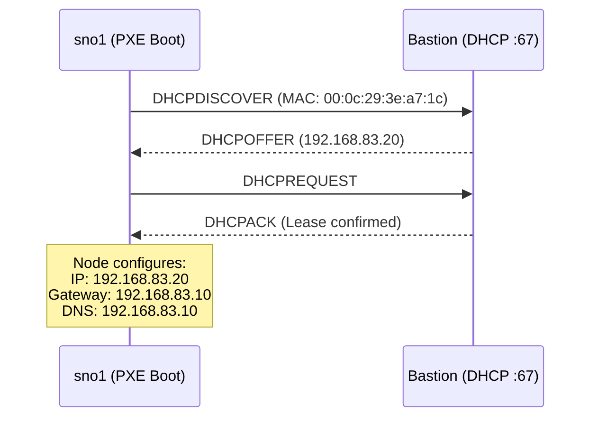

# :material-ethernet: Step 3 — DHCP Server

The DHCP server provides **static IP assignment** via MAC-based reservations to the SNO node. This ensures the node always receives the same IP address (`192.168.83.20`) that matches the DNS records.

---

## Concept



---

## 3.1 — Install DHCP Server

```bash
dnf install dhcp-server -y
```

---

## 3.2 — Configure DHCPd

Edit the DHCP configuration file:

```bash
vim /etc/dhcp/dhcpd.conf
```

Replace with the following:

```apache title="/etc/dhcp/dhcpd.conf" linenums="1"
#
# DHCP Server Configuration file.
#   see /usr/share/doc/dhcp-server/dhcpd.conf.example
#   see dhcpd.conf(5) man page
#

authoritative;                    # (1)!
ddns-update-style interim;
allow booting;
allow bootp;
allow unknown-clients;
ignore client-updates;
default-lease-time 14400;         # (2)!
max-lease-time 14400;

option space pxelinux;
option pxelinux.magic code 208 = string;
option pxelinux.configfile code 209 = text;
option pxelinux.pathprefix code 210 = text;
option pxelinux.reboottime code 211 = unsigned integer 32;
option architecture-type code 93 = unsigned integer 16;

subnet 192.168.83.0 netmask 255.255.255.0 {
    option routers                  192.168.83.10;   # (3)!
    option subnet-mask              255.255.255.0;
    option domain-name              "ocp.local";
    option domain-name-servers      192.168.83.10;   # (4)!
    range 192.168.83.80 192.168.83.99;             # (5)!
}

# SNO Node — Static Reservation
host sno1 {
    hardware ethernet 00:0c:29:3e:a7:1c;             # (6)!
    fixed-address 192.168.83.20;
}
```

1.  :material-shield-check: Makes this the authoritative DHCP server for the subnet.
2.  :material-clock: Lease time of 4 hours (14400 seconds).
3.  :material-router: Default gateway — the Bastion's internal IP.
4.  :material-dns: DNS server — the Bastion's BIND service.
5.  :material-ip-network: Dynamic range for any additional devices (not used by SNO).
6.  :fontawesome-solid-triangle-exclamation: **Replace this MAC address** with the actual MAC of your SNO node's NIC.

!!! danger "Update the MAC Address"

    The `hardware ethernet` value **must match** the MAC address of the SNO node's network interface. You can find this from:

    - VMware: VM Settings → Network Adapter → Advanced → MAC Address
    - KVM/libvirt: `virsh domiflist <vm-name>`
    - Bare metal: `ip link show` on the node (if accessible)

---

## 3.3 — Open Firewall Ports

```bash
firewall-cmd --add-service=dhcp --zone=internal --permanent
firewall-cmd --reload
```

### Verify

```bash
firewall-cmd --list-all --zone=internal
```

You should see `dhcp` listed under **services**.

---

## 3.4 — Enable and Start the Service

```bash
systemctl enable --now dhcpd
systemctl status dhcpd
```

Expected:
<div class="cmd-output">
● dhcpd.service - DHCPv4 Server Daemon<br/>
&nbsp;&nbsp;&nbsp;Loaded: loaded<br/>
&nbsp;&nbsp;&nbsp;Active: <span class="success">active (running)</span>
</div>

---

## 3.5 — Verify Lease Assignment

After the SNO node boots and requests an IP, check the lease file:

```bash
cat /var/lib/dhcpd/dhcpd.leases
```

You should see an entry for `192.168.83.20` mapped to the SNO node's MAC address.

---

## Configuration Variants

Your training repository includes two DHCP configuration variants:

=== "VMware (dhcpd.conf)"

    Uses subnet `192.168.83.0/24` with VMware-specific MAC addresses and PXE options.

    Key differences:

    - Includes `option space pxelinux` for PXE boot
    - MAC: `00:0c:29:3e:a7:1c` (VMware format)

=== "KVM/libvirt (dhcpd_SNO.conf)"

    Simplified config for KVM environments.

    Key differences:

    - No PXE options
    - MAC: `52:54:00:3e:df:bf` (KVM/QEMU format)
    - Gateway pointed to `192.168.10.10`

!!! tip "Choose the Right Config"

    Select the configuration that matches your hypervisor. The subnet, gateway, and MAC addresses must be adjusted accordingly.

---

## Troubleshooting

| Symptom | Cause | Fix |
|---------|-------|-----|
| `dhcpd` fails to start | Wrong subnet/interface | Check `journalctl -u dhcpd` for details |
| Node gets wrong IP | MAC mismatch | Verify `hardware ethernet` matches actual NIC |
| Node gets no IP | DHCP not listening on correct interface | Check `/etc/sysconfig/dhcpd` for `DHCPDARGS` |
| Node has no internet | Wrong gateway / DNS | Verify `option routers` and `option domain-name-servers` |

!!! success "Checkpoint"

    DHCP is configured and running. The SNO node will receive IP `192.168.83.20` with the Bastion as its gateway and DNS server.

---

**Next:** [:octicons-arrow-right-24: Step 4 — HAProxy Load Balancer](haproxy.md)
