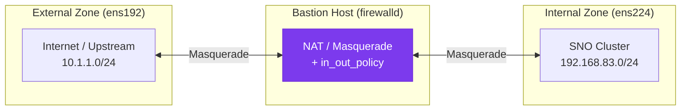

# :material-wall-fire: Step 1 — Firewall Configuration

The Bastion Host uses **firewalld** with zone-based policies to separate external and internal traffic, enable NAT (masquerade), and allow specific service ports.

---

## Concept



The Bastion acts as a **NAT gateway** — internal nodes (SNO) can reach the internet through the Bastion, but external hosts cannot directly reach the internal network.

---

## 1.1 — Assign Interfaces to Zones

Each NIC must be assigned to the correct firewalld zone:

```bash
# Assign the internal NIC to the internal zone
nmcli connection modify ens224 connection.zone internal

# Assign the external NIC to the external zone
nmcli connection modify ens192 connection.zone external

# Reload firewall to apply
firewall-cmd --reload
```

### Verify Zone Assignment

```bash
firewall-cmd --get-active-zones
```

Expected output:
<div class="cmd-output">
external<br/>
&nbsp;&nbsp;interfaces: ens192<br/>
internal<br/>
&nbsp;&nbsp;interfaces: ens224
</div>

---

## 1.2 — Enable Masquerade (NAT)

Masquerade must be enabled on **both zones** to allow traffic forwarding:

```bash
# Enable masquerade (NAT) on both zones
firewall-cmd --zone=external --add-masquerade --permanent
firewall-cmd --zone=internal --add-masquerade --permanent
firewall-cmd --reload
```

### Verify IP Forwarding

```bash
cat /proc/sys/net/ipv4/ip_forward
```

Expected output:
<div class="cmd-output">
<span class="success">1</span>
</div>

!!! info "IP Forwarding"

    The value `1` confirms that the kernel is forwarding packets between interfaces. If this shows `0`, you may need to enable it manually in `/etc/sysctl.conf`:

    ```bash
    echo "net.ipv4.ip_forward = 1" >> /etc/sysctl.conf
    sysctl -p
    ```

---

## 1.3 — Create Routing Policy (Internal → External)

A firewalld **policy** is required to explicitly allow traffic from the internal zone to route through to the external zone:

```bash
# Create a new routing policy
firewall-cmd --permanent --new-policy in_out_policy

# Set the ingress zone (source of traffic)
firewall-cmd --permanent --policy in_out_policy --add-ingress-zone internal

# Set the egress zone (destination of traffic)
firewall-cmd --permanent --policy in_out_policy --add-egress-zone external

# Allow all traffic matching this policy
firewall-cmd --permanent --policy in_out_policy --set-target ACCEPT

# Apply changes
firewall-cmd --reload
```

!!! tip "Why a Policy?"

    In `firewalld`, zones control traffic **to and from the host itself**. To control traffic **between zones** (i.e., routing/forwarding), you need a **policy object**. The `in_out_policy` allows internal clients to reach the internet via NAT.

---

## 1.4 — Verify Final Configuration

```bash
# Check external zone
firewall-cmd --list-all --zone=external

# Check internal zone
firewall-cmd --list-all --zone=internal
```

??? example "Expected Output — External Zone"

    ```
    external (active)
      target: default
      icmp-block-inversion: no
      interfaces: ens192
      sources:
      services: ssh
      ports:
      protocols:
      forward: yes
      masquerade: yes
      forward-ports:
      source-ports:
      icmp-blocks:
      rich rules:
    ```

??? example "Expected Output — Internal Zone"

    ```
    internal (active)
      target: default
      icmp-block-inversion: no
      interfaces: ens224
      sources:
      services: cockpit dhcpv6-client mdns samba-client ssh
      ports:
      protocols:
      forward: yes
      masquerade: yes
      forward-ports:
      source-ports:
      icmp-blocks:
      rich rules:
    ```

---

## Summary

| Setting | External Zone | Internal Zone |
|---------|---------------|---------------|
| Interface | `ens192` | `ens224` |
| Masquerade | ✅ Enabled | ✅ Enabled |
| IP Forward | ✅ `1` | ✅ `1` |
| Routing Policy | — | `in_out_policy` → external |

!!! success "Checkpoint"

    The firewall is configured. Internal nodes will be able to reach the internet through the Bastion once they have an IP address (DHCP) and can resolve DNS names.

---

**Next:** [:octicons-arrow-right-24: Step 2 — DNS Server (BIND)](dns.md)
