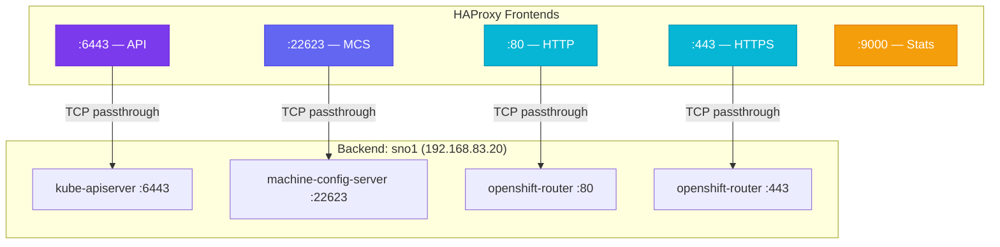

# :material-scale-balance: Step 4 — HAProxy Load Balancer

HAProxy acts as a **Layer 4 (TCP) load balancer** on the Bastion, proxying traffic to the SNO node for the Kubernetes API, Machine Config Server, and application Ingress.

---

## Why HAProxy for SNO?

!!! question "Do I need a load balancer for a single node?"

    Yes. Even with a single node, OpenShift **requires** API and Ingress traffic to be resolved and routed through the `api.*` and `*.apps.*` DNS names. HAProxy provides a consistent entry point and also enables the **HAProxy Stats dashboard** for monitoring.

    In multi-node clusters, HAProxy distributes traffic across multiple control plane and worker nodes. In SNO, all backends point to the same node.

---

## 4.1 — Install HAProxy

```bash
dnf install haproxy -y
```

---

## 4.2 — Configure HAProxy

Edit the HAProxy configuration file:

```bash
vim /etc/haproxy/haproxy.cfg
```

Replace with the following:

```haproxy title="/etc/haproxy/haproxy.cfg" linenums="1"
# =============================================================================
# Global settings
# =============================================================================
global
    maxconn     20000
    log         /dev/log local0 info
    chroot      /var/lib/haproxy
    pidfile     /var/run/haproxy.pid
    user        haproxy
    group       haproxy
    daemon

    # turn on stats unix socket
    stats socket /var/lib/haproxy/stats

# =============================================================================
# Defaults
# =============================================================================
defaults
    log                     global
    mode                    http
    option                  httplog
    option                  dontlognull
    option http-server-close
    option redispatch
    option forwardfor       except 127.0.0.0/8
    retries                 3
    maxconn                 20000
    timeout http-request    10000ms
    timeout http-keep-alive 10000ms
    timeout check           10000ms
    timeout connect         40000ms
    timeout client          300000ms
    timeout server          300000ms
    timeout queue           50000ms

# =============================================================================
# HAProxy Stats Dashboard (1)
# =============================================================================
listen stats
    bind :9000
    stats uri /stats
    stats refresh 10000ms

# =============================================================================
# Frontend/Backend: Kubernetes API Server (Port 6443) (2)
# =============================================================================
frontend k8s_api_frontend
    bind :6443
    default_backend k8s_api_backend
    mode tcp

backend k8s_api_backend
    mode tcp
    balance source
    server      master-sno1 192.168.83.20:6443 check

# =============================================================================
# Frontend/Backend: Machine Config Server (Port 22623) (3)
# =============================================================================
frontend ocp_machine_config_server_frontend
    mode tcp
    bind :22623
    default_backend ocp_machine_config_server_backend

backend ocp_machine_config_server_backend
    mode tcp
    balance source
    server      master-sno1 192.168.83.20:22623 check

# =============================================================================
# Frontend/Backend: HTTP Ingress (Port 80) (4)
# =============================================================================
frontend ocp_http_ingress_frontend
    bind :80
    default_backend ocp_http_ingress_backend
    mode tcp

backend ocp_http_ingress_backend
    balance source
    mode tcp
    server      worker-sno1 192.168.83.20:80 check

# =============================================================================
# Frontend/Backend: HTTPS Ingress (Port 443)
# =============================================================================
frontend ocp_https_ingress_frontend
    bind *:443
    default_backend ocp_https_ingress_backend
    mode tcp

backend ocp_https_ingress_backend
    mode tcp
    balance source
    server      worker-sno1 192.168.83.20:443 check
```

1.  :material-chart-bar: Stats dashboard accessible at `http://bastion.ocp.local:9000/stats`
2.  :material-api: Kubernetes API — used by `oc`, `kubectl`, and cluster components
3.  :material-cog: Machine Config Server — serves Ignition configs during bootstrap
4.  :material-web: HTTP/HTTPS Ingress — routes all `*.apps.sno.ocp.local` traffic

---

## Port & Traffic Summary



| Frontend | Port | Mode | Backend | Purpose |
|----------|------|------|---------|---------|
| `k8s_api_frontend` | 6443 | TCP | `sno1:6443` | Kubernetes API |
| `ocp_machine_config_server_frontend` | 22623 | TCP | `sno1:22623` | Ignition config delivery |
| `ocp_http_ingress_frontend` | 80 | TCP | `sno1:80` | HTTP application traffic |
| `ocp_https_ingress_frontend` | 443 | TCP | `sno1:443` | HTTPS application traffic |
| `stats` | 9000 | HTTP | — | HAProxy monitoring dashboard |

---

## 4.3 — Validate Configuration

```bash
haproxy -c -f /etc/haproxy/haproxy.cfg
```

Expected:
<div class="cmd-output">
Configuration file is valid<br/>
<span class="success">[OK]</span>
</div>

---

## 4.4 — Open Firewall Ports

```bash
# API Server
firewall-cmd --add-port=6443/tcp --zone=internal --permanent
firewall-cmd --add-port=6443/tcp --zone=external --permanent

# Machine Config Server (internal only)
firewall-cmd --add-port=22623/tcp --zone=internal --permanent

# HAProxy Stats (external for monitoring)
firewall-cmd --add-port=9000/tcp --zone=external --permanent

# HTTP / HTTPS Ingress
firewall-cmd --add-service=http --zone=internal --permanent
firewall-cmd --add-service=http --zone=external --permanent
firewall-cmd --add-service=https --zone=internal --permanent
firewall-cmd --add-service=https --zone=external --permanent

# Apply
firewall-cmd --reload
```

### Verify

```bash
firewall-cmd --list-all --zone=external
firewall-cmd --list-all --zone=internal
```

---

## 4.5 — Configure SELinux

HAProxy needs permission to bind to non-standard ports:

```bash
setsebool -P haproxy_connect_any 1
```

!!! warning "SELinux"

    Without this, HAProxy will fail to start with a `Permission denied` error when binding to ports like 6443 and 22623. The `-P` flag makes the change persistent across reboots.

---

## 4.6 — Enable and Start the Service

```bash
systemctl enable --now haproxy.service
systemctl status haproxy.service
```

Expected:
<div class="cmd-output">
● haproxy.service - HAProxy Load Balancer<br/>
&nbsp;&nbsp;&nbsp;Loaded: loaded<br/>
&nbsp;&nbsp;&nbsp;Active: <span class="success">active (running)</span>
</div>

---

## 4.7 — Verify Stats Dashboard

Open a browser and navigate to:

```
http://bastion.ocp.local:9000/stats
```

You should see the HAProxy Stats page showing all frontends and backends. Before the SNO node is installed, all backends will show as **DOWN** (red) — this is expected.

!!! success "Checkpoint"

    All Bastion infrastructure services are now configured and running:

    - [x] **Firewall** — Zones, NAT, policy
    - [x] **DNS** — Forward, reverse, SRV records
    - [x] **DHCP** — Static MAC reservation
    - [x] **HAProxy** — API, MCS, Ingress proxying

    The Bastion is ready to support the OpenShift installation. 🎉

---

**Next:** [:octicons-arrow-right-24: OpenShift Installation — Prerequisites](../openshift-install/prerequisites.md)
