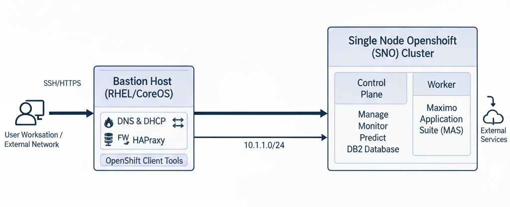

# :material-cloud-braces: Single Node OpenShift Installation Guide

**A complete, production-grade walkthrough for deploying OpenShift 4.14 on a Single Node (SNO) topology with full Bastion Host infrastructure services.**

*Training Series — OpenShift / MAS Technical Track*

## Welcome

This documentation provides a **step-by-step installation guide** for deploying a **Single Node OpenShift (SNO)** cluster backed by a dedicated **Bastion Host** running all supporting infrastructure services. It is designed as a hands-on training companion for engineers preparing to deploy OpenShift and IBM Maximo Application Suite (MAS) in enterprise environments.

---

## What You Will Build

By the end of this guide, you will have a fully operational environment consisting of:

| Component | Role | IP Address |
|-----------|------|------------|
| **Bastion Host** | DNS, DHCP, HAProxy, OC CLI | `192.168.83.10` (internal) |
| **SNO Node (sno1)** | Control Plane + Worker (all-in-one) | `192.168.83.20` |
| **External Network** | Upstream connectivity | `10.1.1.0/24` |

---

## Architecture

The Bastion Host acts as the **gateway and infrastructure services provider** for the internal `192.168.83.0/24` network. It runs:

- :material-dns: **BIND DNS** — Forward & reverse zone resolution for `ocp.local` / `sno.ocp.local`
- :material-ethernet: **ISC DHCP** — MAC-based static IP assignment for the SNO node
- :material-scale-balance: **HAProxy** — Layer 4 load balancing for API (6443), MCS (22623), HTTP/S (80/443)
- :material-wall-fire: **firewalld** — Zone-based firewall with NAT/masquerade between internal & external

---

## Prerequisites

!!! info "Before You Begin"

    Ensure the following are available before starting the installation:

- [x] **RHEL 8/9 server** (or compatible) for the Bastion Host with **two NICs**
    - `ens192` → External network (`10.1.1.0/24`)
    - `ens224` → Internal network (`192.168.83.0/24`)
- [x] **Bare-metal server or VM** for the SNO node with minimum:
    - 16 vCPU, 64 GB RAM, 120 GB OS disk + 500 GB secondary disk (SSD preferred)
    - Single NIC on the internal network
- [x] **Red Hat pull secret** from [console.redhat.com](https://console.redhat.com/openshift/install/pull-secret)
- [x] **Internet access** (direct or via proxy) from the Bastion Host
- [x] **DNS domain** planned: `ocp.local` (base) / `sno.ocp.local` (cluster)

---

## Guide Structure

The guide is organized into logical phases:

-   :material-server-network:{ .lg .middle } **Bastion Host Setup**

    ---

    Configure the Bastion as the infrastructure backbone — firewall zones, DNS, DHCP, and HAProxy.

    [:octicons-arrow-right-24: Start Setup](bastion-setup/index.md)

-   :material-kubernetes:{ .lg .middle } **OpenShift Installation**

    ---

    Download OCP tools, prepare `install-config.yaml`, generate manifests, and boot the SNO node.

    [:octicons-arrow-right-24: Begin Installation](openshift-install/index.md)

-   :material-check-decagram:{ .lg .middle } **Post-Installation**

    ---

    Validate the cluster, run smoke tests, and troubleshoot common issues.

    [:octicons-arrow-right-24: Validate Cluster](post-install/index.md)

-   :material-ibm:{ .lg .middle } **MAS Installation**

    ---

    Prepare storage, licensing, and deploy IBM Maximo Application Suite via the CLI automation tool.

    [:octicons-arrow-right-24: Prepare for MAS](mas-install/index.md)

---

## Quick Reference — Key Endpoints

Once the cluster is fully operational, these are the primary access points:

| Endpoint | URL / Address |
|----------|---------------|
| **OpenShift Console** | `https://console-openshift-console.apps.sno.ocp.local` |
| **OAuth Server** | `https://oauth-openshift.apps.sno.ocp.local` |
| **API Server** | `https://api.sno.ocp.local:6443` |
| **HAProxy Stats** | `http://bastion.ocp.local:9000/stats` |
| **Machine Config Server** | `https://api-int.sno.ocp.local:22623` |

---

!!! tip "Training Tip"

    This guide follows the actual configuration files and commands used during the **Technical Training — OpenShift/MAS Series**. All config files are included inline and also available in the repository subdirectories (`DNS_SNO/`, `DHCP_SNO/`, `HAproxy_SNO/`).
