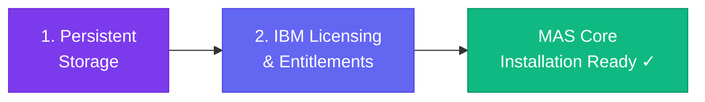

# :material-ibm: MAS Installation Preparations

Now that the Single Node OpenShift (SNO) cluster is operational, the next major objective is to prepare the environment for the **IBM Maximo Application Suite (MAS)**.

MAS is an enterprise-grade suite of applications that has strict prerequisites regarding persistent storage and software licensing. Before we can deploy the MAS core or any of its applications (like Manage, Monitor, or Health), we must bridge the gap between a vanilla OpenShift cluster and an IBM-ready environment.

!!! danger "Minimum Hardware Requirements"
    Before proceeding with MAS installation, guarantee your Single Node OpenShift VM meets the absolute minimum compute specifications:
    
    * **16 vCPU Cores**
    * **64 GB RAM**
    * A secondary **SSD disk** (for LVM block storage)

!!! quote "Reference Repository"
    The workflows detailed in this section draw inspiration and best practices from the official IBM repository for deploying MAS on Single Node OpenShift:  
    [:octicons-mark-github-16: `ibm-mas-manage/sno`](https://github.com/ibm-mas-manage/sno/blob/master/docs/index.md)

---

## Preparation Phases

---

## Phase Overview

| Phase | What Happens | Why It's Needed |
|-------|-------------|-----------------|
| **LVM Storage Operator** | Add a 500GB disk and configure the OpenShift LVM Storage Operator. | MAS and its underlying databases (DB2, MongoDB, Kafka) require dynamic block and file storage provisioning. |
| **Entitlement & License** | Obtain the IBM Entitlement key and the AppPoint `.dat` license file. | Required to pull proprietary MAS container images from the IBM registry and activate the suite. |

---

## Use Cases & Sizing

Single Node OpenShift with MAS is appropriate for the following scenarios:

| Use Case | Description |
|----------|-------------|
| **Small Implementations** | MAS Manage-only deployments supporting up to **70 concurrent users** |
| **Satellite / Edge Deployments** | Disconnected or semi-connected sites that sync data back to a central MAS instance |
| **Upgrading Legacy Maximo** | Migrating small Maximo EAM customers onto the MAS platform |
| **Demo & PoC** | Quick proof-of-concept deployments for customer demonstrations |

!!! info "Reference Hardware"
    A validated configuration from the IBM repo uses: **16 Cores, 64 GB RAM, 2 SSDs** (one for OS, one for LVM Storage Operator) running MAS 8.10 + Manage 8.6.

---

## Proceed to Each Step

1. [:octicons-arrow-right-24: 1. LVM Storage Operator Setup](storage.md)
2. [:octicons-arrow-right-24: 2. Entitlement & License File](licensing.md)
3. [:octicons-arrow-right-24: 3. Automated MAS Deployment](automation.md)
