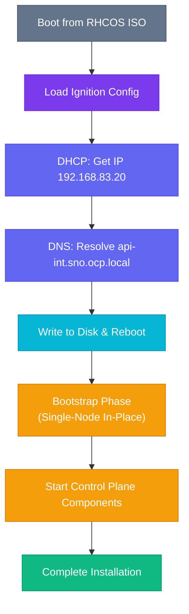

# :material-rocket-launch: Phase 3 — Bootstrap & Installation

This is the final installation phase. Boot the SNO node from the prepared ISO and monitor the installation progress from the Bastion.

---

## 3.1 — Boot the SNO Node

1. **Attach the ISO** to the SNO node's virtual CD/DVD drive (VMware) or pass it via `--cdrom` (KVM/libvirt)
2. **Set boot order** to boot from the CD/DVD first
3. **Power on** the VM / server

The node will:



---

## 3.2 — Monitor the Installation

### From the Bastion

Open a terminal on the Bastion and run:

```bash
openshift-install wait-for install-complete \
  --dir ~/ocp-install \
  --log-level=info
```

!!! info "Expected Duration"

    | Phase | Duration |
    |-------|----------|
    | Bootstrap | 15–30 minutes |
    | Control Plane Operators | 10–20 minutes |
    | Cluster Version finalization | 10–30 minutes |
    | **Total** | **~45–90 minutes** |

### Watch bootstrap specifically

```bash
openshift-install wait-for bootstrap-complete \
  --dir ~/ocp-install \
  --log-level=info
```

Expected final output:
<div class="cmd-output">
INFO Waiting up to 30m0s for the bootstrap to complete...<br/>
<span class="success">INFO It is now safe to remove the bootstrap resources</span>
</div>

---

## 3.3 — Monitor via HAProxy Stats

While the installation progresses, the HAProxy Stats page shows backend health in real-time:

```
http://bastion.ocp.local:9000/stats
```

| Backend | Expected During Install | Expected After Install |
|---------|------------------------|----------------------|
| `k8s_api_backend` | 🟢 UP (after bootstrap starts) | 🟢 UP |
| `ocp_machine_config_server_backend` | 🟢 UP | 🟢 UP |
| `ocp_http_ingress_backend` | 🔴 DOWN (until router starts) | 🟢 UP |
| `ocp_https_ingress_backend` | 🔴 DOWN (until router starts) | 🟢 UP |

---

## 3.4 — SSH Access (Debugging)

If you need to check on the node during installation:

```bash
ssh -i ~/.ssh/id_ed25519 core@192.168.83.20
```

!!! note

    The user is always `core` on RHCOS/CoreOS nodes, not `root`.

Useful debugging commands on the node:

```bash
# Check kubelet status
sudo systemctl status kubelet

# Stream kubelet logs
sudo journalctl -u kubelet -f

# Check container runtime
sudo crictl ps

# Check bootstrap progress
sudo journalctl -b -f -u bootkube.service
```

---

## 3.5 — Installation Complete

When the installation finishes successfully, you'll see:

<div class="cmd-output">
INFO Install complete!<br/>
INFO To access the cluster as the system:admin user:<br/>
&nbsp;&nbsp;&nbsp;&nbsp;export KUBECONFIG=/root/ocp-install/auth/kubeconfig<br/>
INFO Access the OpenShift web console here:<br/>
&nbsp;&nbsp;&nbsp;&nbsp;<span class="success">https://console-openshift-console.apps.sno.ocp.local</span><br/>
INFO Login to the console with user: kubeadmin, password: <span class="warning">&lt;see auth/kubeadmin-password&gt;</span>
</div>

### Set KUBECONFIG

```bash
export KUBECONFIG=~/ocp-install/auth/kubeconfig
```

Make it persistent:

```bash
echo 'export KUBECONFIG=~/ocp-install/auth/kubeconfig' >> ~/.bashrc
source ~/.bashrc
```

### Verify Cluster Access

```bash
oc whoami
```

<div class="cmd-output">
<span class="success">system:admin</span>
</div>

```bash
oc get nodes
```

<div class="cmd-output">
NAME&nbsp;&nbsp;&nbsp;STATUS&nbsp;&nbsp;&nbsp;ROLES&nbsp;&nbsp;&nbsp;&nbsp;&nbsp;&nbsp;&nbsp;&nbsp;&nbsp;&nbsp;&nbsp;&nbsp;&nbsp;&nbsp;&nbsp;&nbsp;&nbsp;&nbsp;&nbsp;AGE&nbsp;&nbsp;&nbsp;VERSION<br/>
sno1&nbsp;&nbsp;&nbsp;<span class="success">Ready</span>&nbsp;&nbsp;&nbsp;&nbsp;control-plane,master,worker&nbsp;&nbsp;&nbsp;30m&nbsp;&nbsp;&nbsp;v1.27.x
</div>

```bash
oc get clusterversion
```

<div class="cmd-output">
NAME&nbsp;&nbsp;&nbsp;&nbsp;&nbsp;&nbsp;VERSION&nbsp;&nbsp;&nbsp;AVAILABLE&nbsp;&nbsp;&nbsp;PROGRESSING&nbsp;&nbsp;&nbsp;SINCE&nbsp;&nbsp;&nbsp;STATUS<br/>
version&nbsp;&nbsp;&nbsp;4.14.0&nbsp;&nbsp;&nbsp;&nbsp;<span class="success">True</span>&nbsp;&nbsp;&nbsp;&nbsp;&nbsp;&nbsp;&nbsp;&nbsp;False&nbsp;&nbsp;&nbsp;&nbsp;&nbsp;&nbsp;&nbsp;&nbsp;&nbsp;10m&nbsp;&nbsp;&nbsp;&nbsp;&nbsp;<span class="success">Cluster version is 4.14.0</span>
</div>

---

## 3.6 — Access the Web Console

Open your browser and navigate to:

```
https://console-openshift-console.apps.sno.ocp.local
```

Login credentials:

| Field | Value |
|-------|-------|
| **Username** | `kubeadmin` |
| **Password** | Contents of `~/ocp-install/auth/kubeadmin-password` |

```bash
cat ~/ocp-install/auth/kubeadmin-password
```

!!! success "🎉 Installation Complete!"

    Your Single Node OpenShift cluster is now operational. Proceed to the post-installation validation steps to confirm everything is working correctly.

---

**Next:** [:octicons-arrow-right-24: Post-Installation — Validation](../post-install/validation.md)
