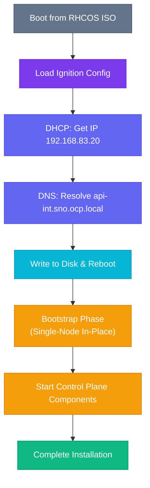

# :material-rocket-launch: Phase 3 — Bootstrap & Installation

This is the final installation phase. Boot the SNO node from the prepared ISO and monitor the installation progress from the Bastion.

---

## 3.1 — Boot the SNO Node

1. **Attach the ISO** to the SNO node's virtual CD/DVD drive (VMware) or pass it via `--cdrom` (KVM/libvirt)
2. **Set boot order** to boot from the CD/DVD first
3. **Power on** the VM / server

The node will:



---

## 3.2 — Monitor the Installation

With the Assisted Installer, you do not need to run local commands to monitor the installation.

1. Keep your browser open to the **Red Hat Hybrid Cloud Console** (`console.redhat.com/openshift`).
2. Navigate to your cluster's **Installation progress** page.
3. You will see real-time status bars for the installation stages:
   - Writing image to disk
   - Rebooting
   - Installing Control Plane
   - Finalizing cluster

Wait for the progress bar to reach 100% and show **Installation completed successfully**.

---

## 3.3 — Download and Configure Kubeconfig

Once the installation is complete, you must download the cluster credentials to interact with it via the CLI on your Bastion host.

1. On the completion page in the web console, click the **Download kubeconfig** button.
2. Transfer this file to your Bastion host. For example, open it in a text editor locally, then create a new file on the Bastion:

```bash
vim /root/kubeconfig
```
*(Paste the contents of the downloaded kubeconfig and save it)*

3. Export the `KUBECONFIG` environment variable so the `oc` CLI knows how to connect to your cluster:

```bash
export KUBECONFIG=/root/kubeconfig
```

Make it persistent across SSH sessions:

```bash
echo 'export KUBECONFIG=/root/kubeconfig' >> ~/.bashrc
```

---

## 3.4 — Verify Cluster Access

Test your connection to the new Single Node OpenShift cluster:

```bash
oc get nodes
```

**Expected output:**
```text
[root@bastion serveradmin]# oc get nodes
NAME                 STATUS   ROLES                         AGE   VERSION
sno1.sno.ocp.local   Ready    control-plane,master,worker   23m   v1.27.16+03a907c
```

---

## 3.5 — Access the Web Console

You can now log in to the OpenShift Web Console.

1. The URL and credentials are provided directly on the Assisted Installer completion screen.
2. Open your browser and navigate to the **Web Console URL** (e.g., `https://console-openshift-console.apps.sno.ocp.local`)
3. Login with the Username **`kubeadmin`** and the auto-generated **Password** shown in the portal.

!!! success "🎉 Installation Complete!"

    Your Single Node OpenShift cluster is now entirely operational! Proceed to the post-installation validation steps to completely verify the deployment.

---

**Next:** [:octicons-arrow-right-24: Post-Installation — Validation](../post-install/validation.md)
